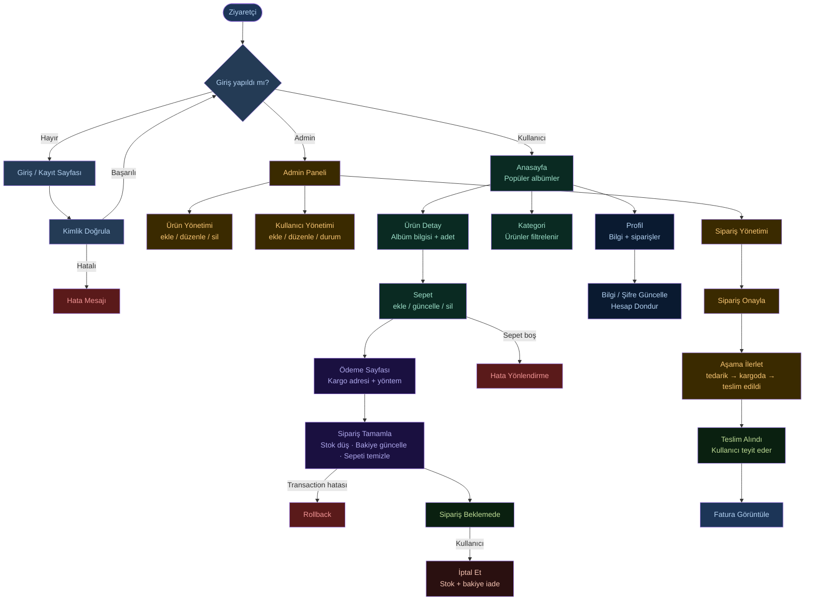
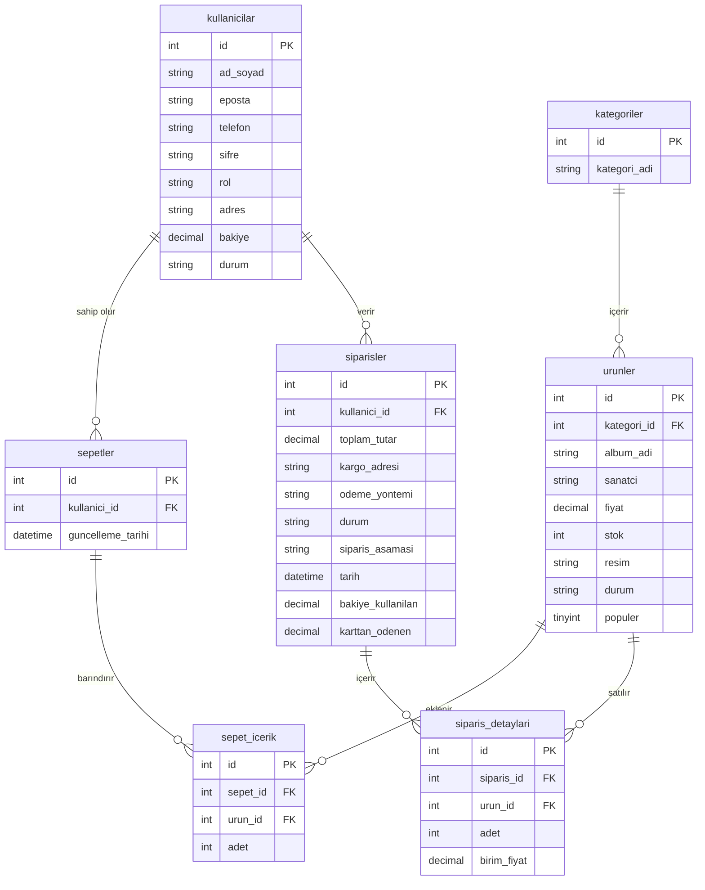

<div align="center">
#  BeatSphere
 


 
**BeatSphere**, müzik albümü satışına yönelik geliştirilmiş bir e-ticaret web uygulamasıdır. Kullanıcılar albümleri inceleyip satın alabilir; yöneticiler ürün, kullanıcı ve sipariş yönetimini tek panelden gerçekleştirebilir.
 
</div>
 
---
 
##  Teknolojiler
 
| Katman | Teknoloji |
|--------|-----------|
| Backend Framework | PHP — CodeIgniter 4 |
| Veritabanı | MySQL (MySQLi sürücüsü) |
| Frontend | HTML, CSS, Bootstrap, JavaScript |
| Sunucu | Apache (XAMPP / WAMP) |
| Oturum Yönetimi | CodeIgniter Session (dosya tabanlı) |
 
---
 
##  Proje Yapısı
 
```
BeatSphere/
├── app/
│   ├── Config/          # Uygulama ayarları (veritabanı, rotalar, güvenlik…)
│   ├── Controllers/     # İş mantığı katmanı
│   │   ├── Home.php           # Anasayfa, profil, statik sayfalar
│   │   ├── Auth.php           # Kayıt / giriş / çıkış
│   │   ├── Admin.php          # Yönetici paneli
│   │   ├── UrunController.php # Ürün listeleme & detay
│   │   ├── SepetController.php# Sepet işlemleri
│   │   ├── SiparisController.php # Ödeme & sipariş
│   │   └── ProfilController.php  # Profil güncelleme
│   ├── Models/          # Veritabanı modelleri
│   │   ├── UrunModel.php
│   │   ├── KullaniciModel.php
│   │   ├── SepetModel.php
│   │   ├── SepetIcerikModel.php
│   │   ├── SiparisModel.php
│   │   └── SiparisDetayModel.php
│   └── Views/           # Arayüz şablonları
│       ├── anasayfa.php
│       ├── sepet.php
│       ├── odeme.php
│       ├── profil.php
│       └── admin/       # Yönetici paneli görünümleri
├── public/
│   ├── assets/          # CSS, JS, görseller
│   └── uploads/         # Yüklenen ürün resimleri
├── writable/            # Cache, log, session dosyaları
└── .env                 # Ortam değişkenleri
```
 
---
##  Diyagramlar
 
### Akış Diyagramı
 

 
---
 
### Varlık-İlişki (ER) Diyagramı
 

 
---
 
---
##  Kurulum
 
### Gereksinimler
 
- PHP 8.1+
- MySQL 5.7+ veya MariaDB 10.4+
- Apache (mod_rewrite aktif)
- XAMPP / WAMP / Laragon önerilir
### Adımlar
 
**1. Projeyi klonlayın**
 
```bash
git clone https://github.com/kullanici-adi/BeatSphere.git
```
 
> Ya da ZIP olarak indirip `htdocs/` (XAMPP) veya `www/` (WAMP) klasörüne çıkartın.
 
**2. Veritabanını oluşturun**
 
phpMyAdmin veya MySQL komut satırında `beatsphere_db` adlı bir veritabanı oluşturun ve gerekli tabloları import edin:
 
```sql
CREATE DATABASE beatsphere_db CHARACTER SET utf8mb4 COLLATE utf8mb4_general_ci;
```
 
**3. `.env` dosyasını düzenleyin**
 
Proje kök dizinindeki `.env` dosyasını açıp aşağıdaki alanları kendi ortamınıza göre güncelleyin:
 
```env
CI_ENVIRONMENT = development
 
app.baseURL = 'http://localhost/BeatSphere/public/'
 
database.default.hostname = localhost
database.default.database = beatsphere_db
database.default.username = root
database.default.password = 
database.default.DBDriver = MySQLi
database.default.port = 3306
```
 
**4. Apache mod_rewrite aktif olduğundan emin olun**
 
`httpd.conf` dosyasında `mod_rewrite` modülünün yorum satırından çıkarılmış olduğunu kontrol edin.
 
**5. Uygulamayı açın**
 
```
http://localhost/BeatSphere/public/
```
 
---
 
##  Veritabanı Tabloları
 
| Tablo | Açıklama |
|-------|----------|
| `kullanicilar` | Kullanıcı hesapları (ad, e-posta, şifre, rol, bakiye, durum) |
| `urunler` | Albüm bilgileri (album_adi, sanatci, fiyat, stok, resim, durum, populer) |
| `kategoriler` | Ürün kategorileri |
| `sepetler` | Kullanıcı sepet başlıkları |
| `sepet_icerik` | Sepetteki ürün kalemleri (adet, urun_id) |
| `siparisler` | Sipariş kayıtları (kullanici_id, toplam tutar, aşama, tarih) |
| `siparis_detay` | Sipariş satır detayları |
 
---
 
##  Özellikler
 
### Kullanıcı Tarafı
-  Anasayfada popüler albümleri listeleme
-  Kategoriye göre ürün filtreleme
-  Sepete ürün ekleme, güncelleme ve silme
-  Bakiye ile ödeme & sipariş tamamlama
-  Sipariş geçmişi görüntüleme, iptal ve teslim alma
-  Sipariş faturası görüntüleme
-  Profil bilgisi ve şifre güncelleme, hesap dondurma
-  Kargo takip sayfası
### Yönetici Paneli (`/admin`)
-  Genel istatistik paneli
-  Ürün ekleme, düzenleme, silme; durum ve popülerlik değiştirme
-  Kullanıcı ekleme, düzenleme, silme; durum değiştirme
-  Sipariş listeleme, onaylama ve aşama ilerleme
---
 
##  Yetkilendirme
 
Uygulama oturum tabanlı yetkilendirme kullanmaktadır:
 
- **Giriş yapılmamış kullanıcılar** sepet, ödeme, profil ve kargo takip sayfalarına yönlendirilir.
- **`rol` alanı** `admin` olan kullanıcılar yönetici paneline erişebilir.
- Şifreler veritabanına hash'lenerek kaydedilmektedir.
---
 
##  Notlar
 
- `writable/` klasörüne (cache, log, session) web sunucusunun yazma yetkisi olmalıdır.
- Ürün görselleri `public/uploads/` klasörüne yüklenmektedir; bu klasörün de yazılabilir olması gerekir.
- Proje geliştirme ortamı için yapılandırılmıştır; canlıya almadan önce `.env` dosyasında `CI_ENVIRONMENT = production` yapın ve `app.baseURL` adresini güncelleyin.
---
