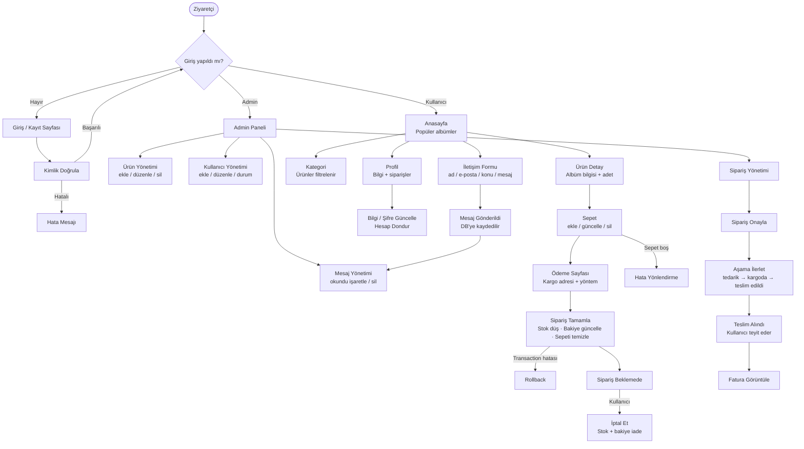
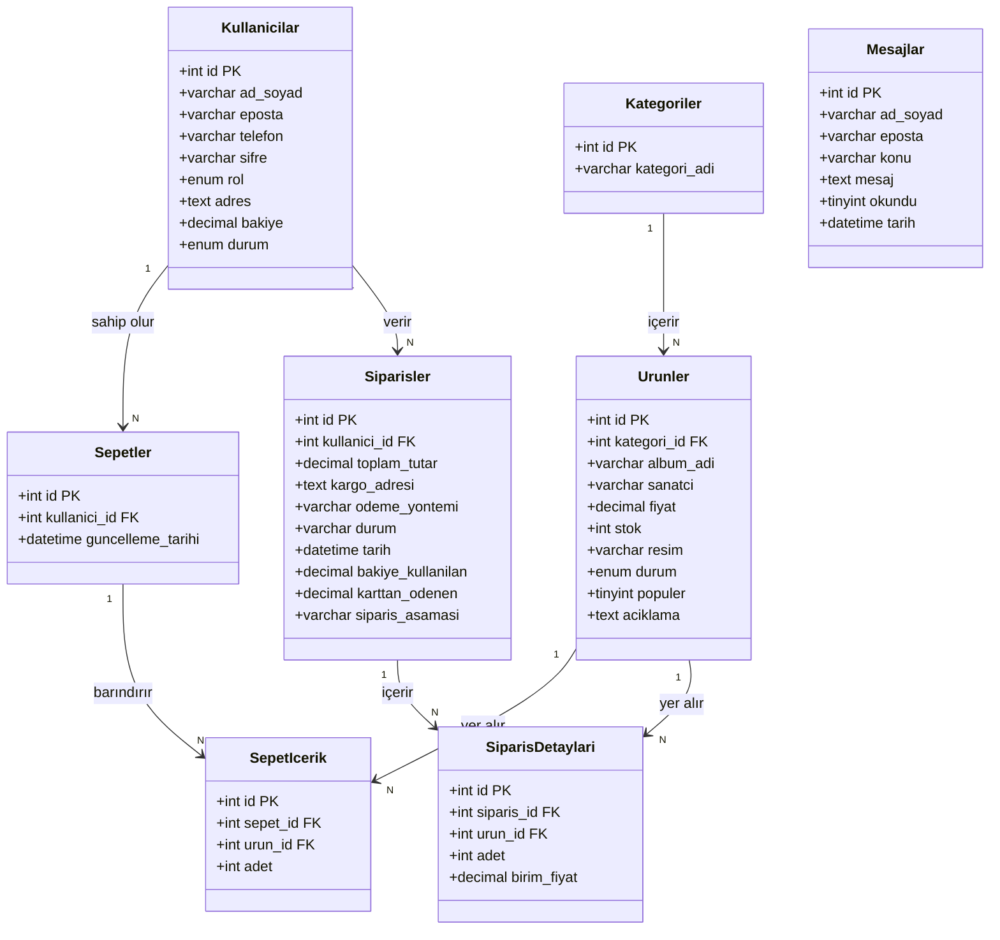

#  BeatSphere
<div align="center">
 


 
**BeatSphere**, müzik albümü satışına yönelik geliştirilmiş bir e-ticaret web uygulamasıdır. Kullanıcılar albümleri inceleyip satın alabilir; yöneticiler ürün, kullanıcı ve sipariş yönetimini tek panelden gerçekleştirebilir.
 
</div>
 
---
 
##  Teknolojiler
 
| Katman | Teknoloji |
|--------|-----------|
| Backend Framework | PHP — CodeIgniter 4 |
| Veritabanı | MySQL (MySQLi sürücüsü) |
| Frontend | HTML, CSS, Bootstrap, JavaScript |
| Sunucu | Apache (XAMPP / WAMP) |
| Oturum Yönetimi | CodeIgniter Session (dosya tabanlı) |
 
---
 
##  Proje Yapısı
 
```
BeatSphere/
├── app/
│   ├── Config/          # Uygulama ayarları (veritabanı, rotalar, güvenlik…)
│   ├── Controllers/     # İş mantığı katmanı
│   │   ├── Home.php           # Anasayfa, profil, statik sayfalar
│   │   ├── Auth.php           # Kayıt / giriş / çıkış
│   │   ├── Admin.php          # Yönetici paneli
│   │   ├── UrunController.php # Ürün listeleme & detay
│   │   ├── SepetController.php# Sepet işlemleri
│   │   ├── SiparisController.php # Ödeme & sipariş
│   │   └── ProfilController.php  # Profil güncelleme
│   ├── Models/          # Veritabanı modelleri
│   │   ├── UrunModel.php
│   │   ├── KullaniciModel.php
│   │   ├── SepetModel.php
│   │   ├── SepetIcerikModel.php
│   │   ├── SiparisModel.php
│   │   └── SiparisDetayModel.php
│   └── Views/           # Arayüz şablonları
│       ├── anasayfa.php
│       ├── sepet.php
│       ├── odeme.php
│       ├── profil.php
│       └── admin/       # Yönetici paneli görünümleri
├── public/
│   ├── assets/          # CSS, JS, görseller
│   └── uploads/         # Yüklenen ürün resimleri
├── writable/            # Cache, log, session dosyaları
└── .env                 # Ortam değişkenleri
```
 
---
##  Diyagramlar
 
### Akış Diyagramı
 

 
---
 
### Varlık-İlişki (ER) Diyagramı

 ```mermaid
erDiagram
    kategoriler ||--o{ urunler : "1'den çoğa (Bir kategori birden fazla ürüne sahip olabilir)"
    kullanicilar ||--o{ sepetler : "1'den çoğa (Bir kullanıcının sepet(ler)i olabilir)"
    kullanicilar ||--o{ siparisler : "1'den çoğa (Bir kullanıcı birden fazla sipariş verebilir)"
    sepetler ||--o{ sepet_icerik : "1'den çoğa (Bir sepet birden fazla ürün içerebilir)"
    urunler ||--o{ sepet_icerik : "1'den çoğa (Bir ürün birden fazla sepette yer alabilir)"
    siparisler ||--o{ siparis_detaylari : "1'den çoğa (Bir siparişin birden fazla detayı/ürünü olabilir)"
    urunler ||--o{ siparis_detaylari : "1'den çoğa (Bir ürün birden fazla siparişte yer alabilir)"

    kategoriler {
        int id PK
        varchar kategori_adi
    }

    kullanicilar {
        int id PK
        varchar ad_soyad
        varchar eposta
        varchar telefon
        varchar sifre
        enum rol
        text adres
        decimal bakiye
        enum durum
    }

    urunler {
        int id PK
        int kategori_id FK
        varchar album_adi
        varchar sanatci
        decimal fiyat
        int stok
        varchar resim
        enum durum
        tinyint populer
        text aciklama
    }

    sepetler {
        int id PK
        int kullanici_id FK
        datetime guncelleme_tarihi
    }

    sepet_icerik {
        int id PK
        int sepet_id FK
        int urun_id FK
        int adet
    }

    siparisler {
        int id PK
        int kullanici_id FK
        decimal toplam_tutar
        text kargo_adresi
        varchar odeme_yontemi
        varchar durum
        datetime tarih
        decimal bakiye_kullanilan
        decimal karttan_odenen
        varchar siparis_asamasi
    }

    siparis_detaylari {
        int id PK
        int siparis_id FK
        int urun_id FK
        int adet
        decimal birim_fiyat
    }

    mesajlar {
        int id PK
        varchar ad_soyad
        varchar eposta
        varchar konu
        text mesaj
        tinyint okundu
        datetime tarih
    }
````
---

###  UML Sınıf Diyagramı
 

 
#### Controller — Model Eşleşmesi
 
| Controller | Model(ler) | Açıklama |
|---|---|---|
| `Auth` | `KullaniciModel` | Giriş, kayıt, çıkış |
| `Home` | `UrunModel`, `KategoriModel` | Ana sayfa, hakkımızda, iletişim |
| `UrunController` | `UrunModel`, `KategoriModel` | Kategori listesi, ürün detayı |
| `SepetController` | `SepetModel`, `SepetIcerikModel`, `UrunModel` | Sepet işlemleri |
| `SiparisController` | `SiparisModel`, `SiparisDetayModel`, `SepetModel`, `UrunModel` | Ödeme, sipariş, iptal, fatura |
| `ProfilController` | `KullaniciModel` | Profil güncelleme, şifre, hesap dondur |
| `Admin` | Tüm modeller | Yönetim paneli |
 

---
 
##  Veritabanı Tabloları
 
| Tablo | Açıklama |
|-------|----------|
| `kullanicilar` | Kullanıcı hesapları (ad, e-posta, şifre, rol, bakiye, durum) |
| `urunler` | Albüm bilgileri (album_adi, sanatci, fiyat, stok, resim, durum, populer) |
| `kategoriler` | Ürün kategorileri |
| `sepetler` | Kullanıcı sepet başlıkları |
| `sepet_icerik` | Sepetteki ürün kalemleri (adet, urun_id) |
| `siparisler` | Sipariş kayıtları (kullanici_id, toplam tutar, aşama, tarih) |
| `siparis_detay` | Sipariş satır detayları |
| `mesajlar` | İletişim formu mesajları (ad_soyad, eposta, konu, mesaj, okundu, tarih) |
 
---
 
##  Özellikler
 
### Kullanıcı Tarafı
-  Anasayfada popüler albümleri listeleme
-  Kategoriye göre ürün filtreleme
-  Sepete ürün ekleme, güncelleme ve silme
-  Bakiye ile ödeme & sipariş tamamlama
-  Sipariş geçmişi görüntüleme, iptal ve teslim alma
-  Sipariş faturası görüntüleme
-  Profil bilgisi ve şifre güncelleme, hesap dondurma
-  Kargo takip sayfası
### Yönetici Paneli (`/admin`)
-  Genel istatistik paneli
-  Ürün ekleme, düzenleme, silme; durum ve popülerlik değiştirme
-  Kullanıcı ekleme, düzenleme, silme; durum değiştirme
-  Sipariş listeleme, onaylama ve aşama ilerleme
-  İletişim formundan gelen mesajları görüntüleme, okundu işaretleme ve silme 
---
 
##  Yetkilendirme
 
Uygulama oturum tabanlı yetkilendirme kullanmaktadır:
 
- **Giriş yapılmamış kullanıcılar** sepet, ödeme, profil ve kargo takip sayfalarına yönlendirilir.
- **`rol` alanı** `admin` olan kullanıcılar yönetici paneline erişebilir.
- Şifreler veritabanına hash'lenerek kaydedilmektedir.
---
 
##  Notlar
 
- `writable/` klasörüne (cache, log, session) web sunucusunun yazma yetkisi olmalıdır.
- Ürün görselleri `public/uploads/` klasörüne yüklenmektedir; bu klasörün de yazılabilir olması gerekir.
- Proje geliştirme ortamı için yapılandırılmıştır; canlıya almadan önce `.env` dosyasında `CI_ENVIRONMENT = production` yapın ve `app.baseURL` adresini güncelleyin.
---
